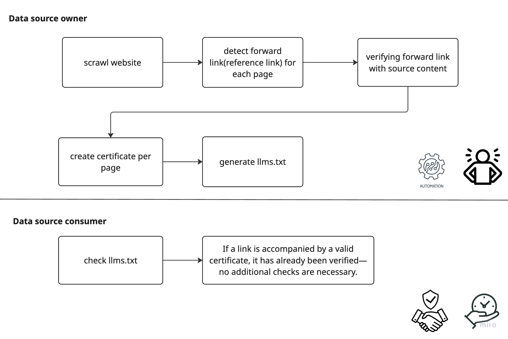

<div align="center">

# 🔗 Forward-Link Manifest (FLM)

[](https://www.python.org/downloads/)
[](LICENSE)
[](https://flask.palletsprojects.com/)
[](https://openai.com/)

**Extending llms.txt for the LLM era** • Enabling trusted external resource discovery

[Demo](#-demo) • [Documentation](#-documentation) • [Quick Start](#-quick-start) • [API Reference](#-api-reference)

</div>

---

## 📋 Overview

A Forward-Link Manifest (FLM) extends traditional `llms.txt` functionality, enabling site owners to explicitly recommend trusted external URLs for LLM-powered crawlers. This structured manifest helps crawlers identify authoritative sources, improving citation accuracy, reducing hallucinations, and optimizing crawl efficiency.

## ✨ Key Benefits

| Feature | Description |
|---------|-------------|
| **🔐 Enhanced Trust & Provenance** | Clearly identifies authoritative external resources |
| **📚 Improved Attribution** | Reduces hallucinations by providing explicitly endorsed references |
| **🎛️ Fine-Grained Control** | Offers more detailed crawl instructions beyond traditional llms.txt |
| **⚡ Efficient Crawling** | Accelerates discovery of trusted resources without exhaustive HTML parsing |

## 🖼️ Demo

<div align="center">
  
</div>

## 🔄 Flow Diagram

<div align="center">
  
</div>

## 📖 Documentation

For detailed documentation and examples, visit: [https://github.com/mnm-matin/flm.txt](https://github.com/mnm-matin/flm.txt)

## 💡 Example Usage

```txt
User-agent: llm-search-bot
Disallow: /drafts/
Allow: /

Forward: https://example.org/whitepaper.pdf
Forward: https://partner.example.com/api-spec
Digest-SHA256: https://example.org/whitepaper.pdf 517f2e...
```

## 🔧 Relationship to Existing Standards

- **Complements** `llms.txt` (does not replace it)
- **Different from** `sitemap.xml` (lists external, trusted resources rather than internal pages)

## 🚀 Quick Start

### Prerequisites

- Python 3.8+
- `uv` package manager
- OpenAI API key

### Installation

1. **Create a virtual environment using `uv`**
   ```bash
   uv venv
   source .venv/bin/activate
   ```

2. **Install dependencies**
   ```bash
   uv pip install -r requirements.txt
   ```

3. **Install Playwright browsers**
   ```bash
   playwright install
   ```

4. **Configure environment variables**
   ```bash
   echo "OPENAI_API_KEY=your_openai_api_key_here" > .env
   ```

5. **Launch the application**
   ```bash
   python app.py
   ```

The application will be available at `http://localhost:5055`

## 🌐 API Reference

### Endpoints

| Endpoint | Method | Description |
|----------|--------|-------------|
| `/` | GET | Main interface for the FLM generator |
| `/api/flm?domain=example.com` | GET | Generate FLM for a specific domain |

### Usage Examples

**Web Interface:**
```
http://localhost:5055
```

**API Call:**
```bash
curl "http://localhost:5055/api/flm?domain=example.com"
```

## 🤝 Contributing

We welcome contributions! Please see our [Contributing Guidelines](CONTRIBUTING.md) for details.

## 📝 License

This project is licensed under the MIT License - see the [LICENSE](LICENSE) file for details.

---

<div align="center">
  
## 🙏 Special Thanks To Our Supporters

<table>
  <tr>
    <td align="center" width="33.33%">
      <a href="https://peec.ai/">
        
        <br><strong>PEEC.AI</strong>
      </a>
    </td>
    <td align="center" width="33.33%">
      <a href="https://techeurope.io/">
        
        <br><strong>{Tech : Europe}</strong>
      </a>
    </td>
    <td align="center" width="33.33%">
      <a href="https://openai.com/">
        
        <br><strong>OpenAI</strong>
      </a>
    </td>
  </tr>
</table>

</div>
